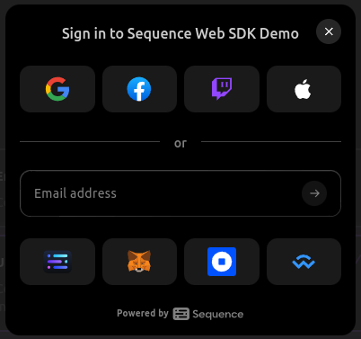
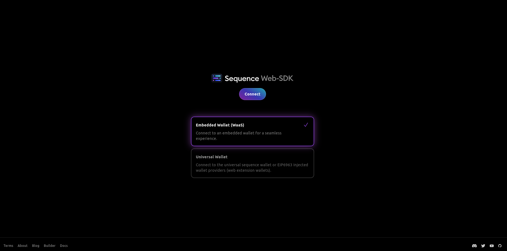

# Sequence Web SDK 🧰

[](https://badge.fury.io/js/@0xsequence%2Fconnect)

Easily integrate web3 wallets in your app with Sequence Web SDK 🧰. Based on [wagmi](https://wagmi.sh/), and supporting all wagmi features.

- Connect via social logins eg: facebook, google, discord, etc...! 🔐🪪
- Connect to popular web3 wallets eg: walletConnect, metamask ! 🦊 ⛓️
- Full-fledged embedded wallet for coins and collectibles 👛 🖼️ 🪙

View the [demo](https://web-sdk.sequence-demos.xyz/)! 👀

## [Migration Guide from kit v4 to web-sdk v5](MIGRATION.md)

## Quick Start

### Installing the Library

`@0xsequence/connect` is the core package. Any extra modules require this package to be installed first.
To install this package:

```bash
npm install @0xsequence/connect @0xsequence/hooks wagmi ethers@6.13.0 viem 0xsequence @tanstack/react-query
```

### Setting up the Library

#### The 'easy' way

- `createConfig(walletType, options)` method is used to create your initial config and prepare sensible defaults that can be overridden

`walletType` is either 'waas' or 'universal'

```ts
interface CreateConfigOptions {
  appName: string
  projectAccessKey: string
  chainIds?: number[]
  defaultChainId?: number
  disableAnalytics?: boolean
  defaultTheme?: Theme
  position?: ModalPosition
  customCSS?: string // Injected into shadow dom
  signIn?: {
    logoUrl?: string
    projectName?: string
    useMock?: boolean
  }
  displayedAssets?: Array<{
    contractAddress: string
    chainId: number
  }>
  ethAuth?: EthAuthSettings

  wagmiConfig?: WagmiConfig // optional wagmiConfig overrides

  waasConfigKey?: string
  enableConfirmationModal?: boolean

  walletConnect?:
    | false
    | {
        projectId: string
      }

  guest?: boolean

  google?:
    | false
    | {
        clientId: string
      }

  apple?:
    | false
    | {
        clientId: string
        redirectURI: string
      }

  X?:
    | boolean
    | {
        clientId: string
        redirectURI: string
      }
      
  email?:
    | boolean
    | {
        legacyEmailAuth?: boolean
      }
}
```

```js
import { SequenceConnect, createConfig } from '@0xsequence/connect'

import Content from './components/Content'

const config = createConfig('waas', {
  projectAccessKey: '<your-project-access-key>',
  chainIds: [1, 137],
  defaultChainId: 1,
  appName: 'Demo Dapp',
  waasConfigKey: '<your-waas-config-key>',

  guest: true,

  google: {
    clientId: '<your-google-client-id>'
  },

  apple: {
    clientId: '<your-apple-client-id>',
    redirectURI: '...'
  },

  X: {
    clientId: '<your-X-client-id>',
    redirectURI: '...'
  },


  walletConnect: {
    projectId: '<your-wallet-connect-id>'
  },

  email: true
})

function App() {
  return (
    <SequenceConnect config={config}>
      <Content />
    </SequenceConnect>
  )
}
```

#### Note about X (formerly Twitter) authentication. X authentication specifically needs a callback route; either a frontend page or a backend endpoint. An frontend example callback page is below:
Please ensure that the redirect uri and the callback page route is identical or X will refuse the authentication

```js
export function XAuthCallback() {
  useEffect(() => {
    const query = new URLSearchParams(window.location.search)

    const payload = {
      code: query.get('code'),
      state: query.get('state')
    }

    if (window.opener) {
      window.opener.postMessage({ type: 'OAUTH_RETURN', data: payload }, '*')
    }

    window.close()
  }, [])

  return (
    <h3>
      you may now close this window.
    </h3>
  )
}
```

#### Need more customization?

React apps must be wrapped by a WagmiProvider and the SequenceConnectProvider components. It is important that the Wagmi wrapper comes before the SequenceConnectProvider wrapper.

```js
import Content from './components/Content'
import { SequenceConnectProvider, getDefaultConnectors, getDefaultChains } from '@0xsequence/connect'
import { SequenceWalletProvider } from '@0xsequence/wallet-widget'
import { SequenceCheckoutProvider } from '@0xsequence/checkout'
import { QueryClient, QueryClientProvider } from '@tanstack/react-query'
import { createConfig, http, WagmiProvider } from 'wagmi'
import { mainnet, polygon, Chain } from 'wagmi/chains'

const projectAccessKey = '<your-project-access-key>'

const chains = getDefaultChains(/* optional array of chain ids to filter */)

const transports = {}

chains.forEach(chain => {
  transports[chain.id] = http()
})

// Universal wallet configuration
const connectors = getDefaultConnectors('universal', {
  projectAccessKey,
  appName: 'Demo Dapp',
  defaultChainId: 137,

  walletConnect: {
    projectId: '<your-wallet-connect-id>'
  }
})

/*
  const connectors = getDefaultWaasConnectors('{
    projectAccessKey,
    defaultChainId: 137,
    appName: 'Demo Dapp',

    waasConfigKey: '<your-waas-config-key>',

    guest: true

    google: {
      clientId
    },

    apple: {
      clientId,
      redirectUrl
    },

    walletConnect: {
      projectId: '<your-wallet-connect-id>'
    }

    email: true
  })
  */

const wagmiConfig = createConfig({
  chains,
  transports,
  connectors
})

const connectConfig = {
  projectAccessKey: '...'
}

const queryClient = new QueryClient()

function App() {
  return (
    <WagmiProvider config={wagmiConfig}>
      <QueryClientProvider client={queryClient}>
        <SequenceConnectProvider config={connectConfig}>
          {/* If you want to use wallet modal to show assets etc. */}
          <SequenceWalletProvider>
            {/* If you want to use checkout functionalities */}
            <SequenceCheckoutProvider>
              <Content />
            </SequenceCheckoutProvider>
          </SequenceWalletProvider>
        </SequenceConnectProvider>
      </QueryClientProvider>
    </WagmiProvider>
  )
}
```

### Opening the Sign in Modal

<div align="center">
  
</div>

Wallet selection is done through a modal which can be called programmatically. Kit allows multiple connection, so it can be called again to connect more wallets.

```js
import { useOpenConnectModal } from '@0xsequence/connect'
import { useDisconnect, useAccount } from 'wagmi'

const MyReactComponent = () => {
  const { setOpenConnectModal } = useOpenConnectModal()

  const { wallets } = useWallets()

  const onClick = () => {
    setOpenConnectModal(true)
  }

  return <>{!wallets.length && <button onClick={onClick}>Sign in</button>}</>
}
```

## Hooks

### useOpenConnectModal

Use the `useOpenConnectModal` to change to open or close the connection modal.

```js
import { useOpenConnectModal } from '@0xsequence/connect'
// ...
const { setOpenConnectModal } = useOpenConnectModal()
setOpenConnectModal(true)
```

### useWallets

Use the `useWallets` hook to manage multiple connected wallets in your application and see linked wallets of the connected embedded wallet. This hook is particularly useful when working with a combination of embedded and external wallets.

```js
import { useWallets } from '@0xsequence/connect'

const {
  wallets, // Array of connected wallets
  linkedWallets, // Array of linked wallets (for embedded wallets)
  setActiveWallet, // Function to set a wallet as active
  disconnectWallet // Function to disconnect a wallet
} = useWallets()

/**
 * Interface representing a connected wallet
 */
interface ConnectedWallet {
  /** Unique identifier */
  id: string
  /** Display name of the wallet */
  name: string
  /** Wallet address */
  address: string
  /** Whether this is the currently active wallet */
  isActive: boolean
  /** Whether this is an embedded wallet */
  isEmbedded: boolean
}

// Switch to a different connected wallet
await setActiveWallet(walletAddress)

// Disconnect a specific wallet
await disconnectWallet(walletAddress)
```

### useTheme

Use the `useTheme` hook to get information about the current theme, such as light or dark.

```js
import { useTheme } from '@0xsequence/connect'
const { theme, setTheme } = useTheme()

setTheme('light')
```

## Customization

The `SequenceConnectProvider` wrapper can accept an optional config object.

The settings are described in more detailed in the Sequence Web SDK documentation.

```js

  const connectConfig = {
    defaultTheme: 'light',
    position: 'top-left',
    signIn: {
      logoUrl: 'https://logo-dark-mode.svg',
      projectName: 'my app',
    },
    // limits the digital assets displayed on the assets summary screen
    displayedAssets: [
      {
        contractAddress: zeroAddress,
        chainId: 137,
      },
      {
        contractAddress: '0x631998e91476da5b870d741192fc5cbc55f5a52e',
        chainId: 137
      }
    ],
    readOnlyNetworks: [10], // Display assets in wallet from Optimism (chain ID 10) in addition to the networks specified in chainIds
  }

  <SequenceConnectProvider config={connectConfig}>
    <App />
  <SequenceConnectProvider>
```

## Packages

| Package                                                                                               | Description                                                     | Docs                                                                                            |
| ----------------------------------------------------------------------------------------------------- | --------------------------------------------------------------- | ----------------------------------------------------------------------------------------------- |
| [@0xsequence/connect](https://github.com/0xsequence/web-sdk/tree/master/packages/connect)             | Core package for Sequence Web SDK                               | [Read more](https://github.com/0xsequence/web-sdk/blob/master/packages/connect/README.md)       |
| [@0xsequence/wallet-widget](https://github.com/0xsequence/web-sdk/tree/master/packages/wallet-widget) | Embedded wallets for viewing and sending coins and collectibles | [Read more](https://github.com/0xsequence/web-sdk/blob/master/packages/wallet-widget/README.md) |
| [@0xsequence/checkout](https://github.com/0xsequence/web-sdk/tree/master/packages/checkout)           | Checkout modal with fiat onramp                                 | [Read more](https://github.com/0xsequence/web-sdk/blob/master/packages/checkout/README.md)      |

## Examples

| Application                                                                       | Description                                                            | Docs                                                                                    |
| --------------------------------------------------------------------------------- | ---------------------------------------------------------------------- | --------------------------------------------------------------------------------------- |
| [example-react](https://github.com/0xsequence/web-sdk/tree/master/examples/react) | React example application showing sign in, wallet and checkout         | [Read more](https://github.com/0xsequence/web-sdk/blob/master/examples/react/README.md) |
| [example-next](https://github.com/0xsequence/web-sdk/tree/master/examples/next)   | Next example application showing sign in, wallet and checkout with SSR | [Read more](https://github.com/0xsequence/web-sdk/blob/master/examples/next/README.md)  |

## Local Development

<div align="center">
  
</div>

The React example can be used to test the library locally.

1. Replace the web-sdk dependencies to the ones of the workspace in order to use hot reload.:

```js
"@0xsequence/connect": "workspace:*",
"@0xsequence/checkout": "workspace:*",
"@0xsequence/wallet-widget": "workspace:*",
```

2. `pnpm install`
3. From the root folder, run `pnpm build` to build the packages OR optionally run `pnpm dev` in a separate terminal to develop in watch mode.
4. From the root folder, run `pnpm dev:react` or `pnpm dev:next` to run the examples. If you want to run the examples in debug mode, run `pnpm debug:react`

## What to do next?

Now that the core package is installed, you can install the [embedded wallet](https://github.com/0xsequence/web-sdk/tree/master/packages/wallet-widget) or take a look at the [checkout](https://github.com/0xsequence/web-sdk/tree/master/packages/checkout).

## LICENSE

Apache-2.0

Copyright (c) 2017-present Horizon Blockchain Games Inc. / https://horizon.io
