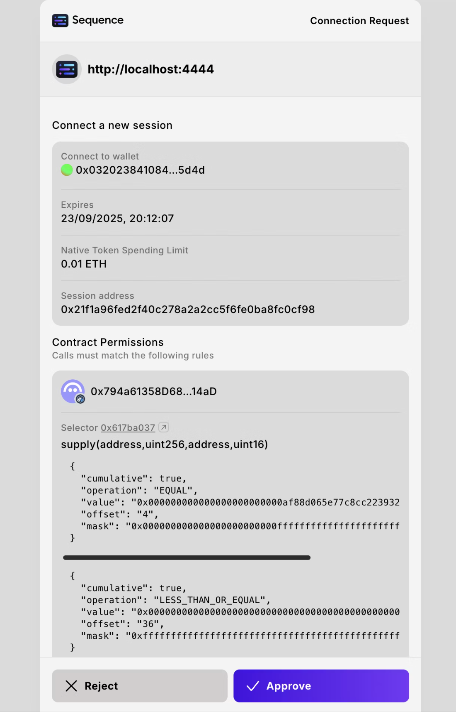

# Sequence Connect SDK

[@0xsequence/connect](https://www.npmjs.com/package/@0xsequence/connect/v/0.0.0-20250924112110) is the React Hooks SDK powering the Sequence wallet experiences. It supports both the Ecosystem (v3) wallet connector and the WaaS connector—configure which one you want per app. Highlights:

- Social logins plus passkeys with Sequence wallets
- Works with Sequence wallets or external web3 wallets (WalletConnect, MetaMask, etc.)
- Inline or modal UI, customizable themes
- Checkout and fiat on-ramp support

## Key Features

- Social auth (Email, Google, Apple)
- Passkeys
- Smart sessions management
- Customizable theming
- Built in UI components

# Quickstart

1. Install the package:

```bash
npm install @0xsequence/connect
# or
pnpm install @0xsequence/connect
# or
yarn add @0xsequence/connect
```

2. Create the wallet configuration

```typescript [config.ts]
import { createConfig, createContractPermission } from '@0xsequence/connect'
import { parseEther, parseUnits } from 'viem'

export const USDC_ADDRESS_ARBITRUM = '0xaf88d065e77c8cC2239327C5EDb3A432268e5831'
export const AAVE_V3_POOL_ADDRESS_ARBITRUM = '0x794a61358D6845594F94dc1DB02A252b5b4814aD'

export const config: any = createConfig({
  projectAccessKey: 'AQAAAAAAAABtDHG1It7lxRF_9bbxw4diip8',
  signIn: {
    projectName: 'Sequence Web SDK Demo'
  },
  walletUrl: 'https://next-acme-wallet.sequence-dev.app/',
  dappOrigin: window.location.origin,
  appName: 'Sequence Web SDK Demo',
  chainIds: [42161],
  defaultChainId: 42161,
  google: true,
  apple: true,
  email: true,
  explicitSessionParams: {
    chainId: 42161,
    nativeTokenSpending: {
      valueLimit: parseEther('0.01') // Allow spending up to 0.01 ETH for gas fees
    },
    expiresIn: {
      hours: 24 // Session lasts for 24 hours
    },
    permissions: [
      createContractPermission({
        address: AAVE_V3_POOL_ADDRESS_ARBITRUM,
        functionSignature: 'function supply(address asset, uint256 amount, address onBehalfOf, uint16 referralCode)',
        rules: [
          {
            param: 'asset',
            type: 'address',
            condition: 'EQUAL',
            value: USDC_ADDRESS_ARBITRUM
          },
          {
            param: 'amount',
            type: 'uint256',
            condition: 'LESS_THAN_OR_EQUAL',
            value: parseUnits('100', 6), // Max cumulative amount of 100 USDC
            cumulative: true
          }
        ]
      })
    ]
  }
})
```

For WaaS, use `createConfig('waas', { ... })` and include WaaS-specific options such as:

- `waasConfigKey`
- social auth providers (google/email/apple/X)
- `walletConnect` projectId
- `enableConfirmationModal`
- `additionalWallets` (e.g., Immutable passport)

3. Wrap your app with the SequenceConnect provider.

```typescript [main.tsx]
import React from "react";
import ReactDOM from "react-dom/client";
import "./index.css";

import App from "./App";
import { config } from "./config";
import { SequenceConnect } from "@0xsequence/connect";

function Dapp() {
  return (
    <SequenceConnect config={config}>
      <App />
    </SequenceConnect>
  );
}

ReactDOM.createRoot(document.getElementById("root")!).render(
  <React.StrictMode>
    <Dapp />
  </React.StrictMode>
);
```

4. Trigger the connection modal

```typescript [App.tsx]
import './App.css'
import { useOpenConnectModal } from '@0xsequence/connect'

function App() {
  const {setOpenConnectModal} = useOpenConnectModal()

  return (
    <>
      <button onClick={() => setOpenConnectModal(true)}>Connect</button>
    </>
  )
}

export default App
```

<div align="center" style="width: 50%; height: 50%;">
  
</div>

### Learn more

For more information, please visit the [Connect SDK documentation](https://docs.sequence.xyz/sdk/web/wallet-sdk/ecosystem/getting-started). Wallet selection is done through a modal by default; the inline examples below show how to embed it when preferred.

Wallet selection is done through a modal which can be called programmatically.

```js
import { useOpenConnectModal } from '@0xsequence/connect'
import { useDisconnect, useAccount } from 'wagmi'

const MyReactComponent = () => {
  const { setOpenConnectModal } = useOpenConnectModal()

  const { isConnected } = useAccount()

  const onClick = () => {
    setOpenConnectModal(true)
  }

  return <>{!isConnected && <button onClick={onClick}>Sign in</button>}</>
}
```

### Inline Connect UI

<div align="center">
  
</div>

Instead of using a modal, you can render the connect UI inline within your layout using the `SequenceConnectInline` component. This is perfect for custom layouts, embedded wallet experiences, or when you want the connect UI to be part of your page flow.

```js
import { SequenceConnectInline, createConfig } from '@0xsequence/connect'
import { useNavigate } from 'react-router-dom'

const config = createConfig('waas', {
  projectAccessKey: '<your-project-access-key>',
  chainIds: [1, 137],
  defaultChainId: 1,
  appName: 'Demo Dapp',
  waasConfigKey: '<your-waas-config-key>',

  // Optional: callback fired when wallet connects successfully
  onConnectSuccess: address => {
    console.log('Connected wallet:', address)
    // Redirect or perform other actions
  },

  google: { clientId: '<your-google-client-id>' },
  email: true
})

function InlinePage() {
  return (
    <div className="my-custom-layout">
      <h1>Connect Your Wallet</h1>
      <SequenceConnectInline config={config} />
    </div>
  )
}
```

#### Key Differences from Modal UI:

- **No padding/margins**: The inline UI removes the default padding designed for modal display
- **Full width**: The component fills its container width
- **No modal backdrop**: Renders directly in your layout
- **Custom positioning**: You control the placement with your own CSS/layout

#### Advanced: Using SequenceConnectInlineProvider

For more control, you can use the lower-level `SequenceConnectInlineProvider`:

```js
import { SequenceConnectInlineProvider } from '@0xsequence/connect'
import { WagmiProvider } from 'wagmi'
import { QueryClient, QueryClientProvider } from '@tanstack/react-query'

const queryClient = new QueryClient()

function App() {
  return (
    <WagmiProvider config={wagmiConfig}>
      <QueryClientProvider client={queryClient}>
        <SequenceConnectInlineProvider config={connectConfig}>
          <YourContent />
        </SequenceConnectInlineProvider>
      </QueryClientProvider>
    </WagmiProvider>
  )
}
```

## Hooks

### useOpenConnectModal

Use the `useOpenConnectModal` to change to open or close the connection modal.

```js
import { useOpenConnectModal } from '@0xsequence/connect'
// ...
const { setOpenConnectModal } = useOpenConnectModal()
setOpenConnectModal(true)
```

### useTheme

Use the `useTheme` hook to get information about the current theme, such as light or dark, or set it to something else.

```js
import { useTheme } from '@0xsequence/connect'
const { theme, setTheme } = useTheme()

setTheme('light')
```

## Customization

The `SequenceConnectProvider` wrapper can accept an optional config object.

The settings are described in more detailed in the Sequence Web SDK documentation.

```js

  const connectConfig =  {
    defaultTheme: 'light',
    position: 'top-left',
    signIn: {
      logoUrl: 'https://logo-dark-mode.svg',
      projectName: 'my app',
    },
    // limits the digital assets displayed on the assets summary screen
    displayedAssets: [
      {
        contractAddress: zeroAddress,
        chainId: 137,
      },
      {
        contractAddress: '0x631998e91476da5b870d741192fc5cbc55f5a52e',
        chainId: 137
      }
    ],
    readOnlyNetworks: [10],
    // callback fired when wallet connects successfully
    onConnectSuccess: (address) => {
      console.log('Wallet connected:', address)
      // Perform actions like redirecting, analytics tracking, etc.
    },
  }

  <SequenceConnectProvider config={connectConfig}>
    <App />
  <SequenceConnectProvider>
```

## Packages

| Package                                                                                               | Description                                                     | Docs                                                                                            |
| ----------------------------------------------------------------------------------------------------- | --------------------------------------------------------------- | ----------------------------------------------------------------------------------------------- |
| [@0xsequence/connect](https://github.com/0xsequence/web-sdk/tree/master/packages/connect)             | Core package for Sequence Web SDK                               | [Read more](https://github.com/0xsequence/web-sdk/blob/master/packages/connect/README.md)       |
| [@0xsequence/wallet-widget](https://github.com/0xsequence/web-sdk/tree/master/packages/wallet-widget) | Embedded wallets for viewing and sending coins and collectibles | [Read more](https://github.com/0xsequence/web-sdk/blob/master/packages/wallet-widget/README.md) |
| [@0xsequence/checkout](https://github.com/0xsequence/web-sdk/tree/master/packages/checkout)           | Checkout modal with fiat onramp                                 | [Read more](https://github.com/0xsequence/web-sdk/blob/master/packages/checkout/README.md)      |
| [example-react](https://github.com/0xsequence/web-sdk/tree/master/examples/react)                     | Example application showing sign in, wallet and checkout        | [Read more](https://github.com/0xsequence/web-sdk/blob/master/examples/react/README.md)         |

## Local Development

<div align="center">
  
</div>

The React example can be used to test the library locally.

1. `pnpm install`
2. From the root folder, run `pnpm build` to build the packages.
3. From the root folder, run `pnpm dev:react` or `pnpm dev:next` to run the examples.

# Setting specific functionalities to dev

Specific functionalities such as the APIs, credit card processors can be set to use the dev environments through the variables in `globalThis`

```
__WEB_SDK_DEV_GLOBAL__ : sets everything to dev
__WEB_SDK_DEV_SARDINE__ : sets only sardine to dev
__WEB_SDK_DEV_TRANSAK__ : sets only transak to dev
__WEB_SDK_DEV_SEQUENCE_APIS__ : sets only the sequence apis to dev
__WEB_SDK_DEV_SARDINE_PROJECT_ACCESS_KEY__ : the project access key used to query the client token for sardine. Must use a dev access key if the everything is using prod, but if sardine is using dev
```

## What to do next?

Now that the core package is installed, you can install the [embedded wallet](https://github.com/0xsequence/web-sdk/tree/master/packages/wallet-widget) or take a look at the [checkout](https://github.com/0xsequence/web-sdk/tree/master/packages/checkout).

## LICENSE

Apache-2.0

Copyright (c) 2017-present Horizon Blockchain Games Inc. / https://horizon.io
